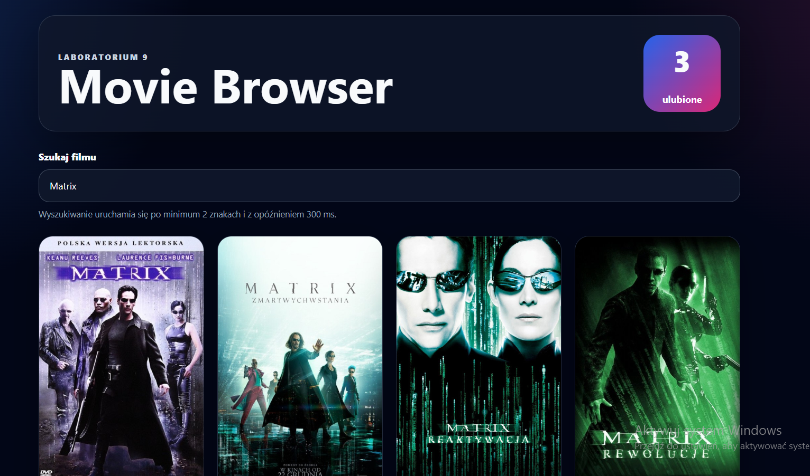
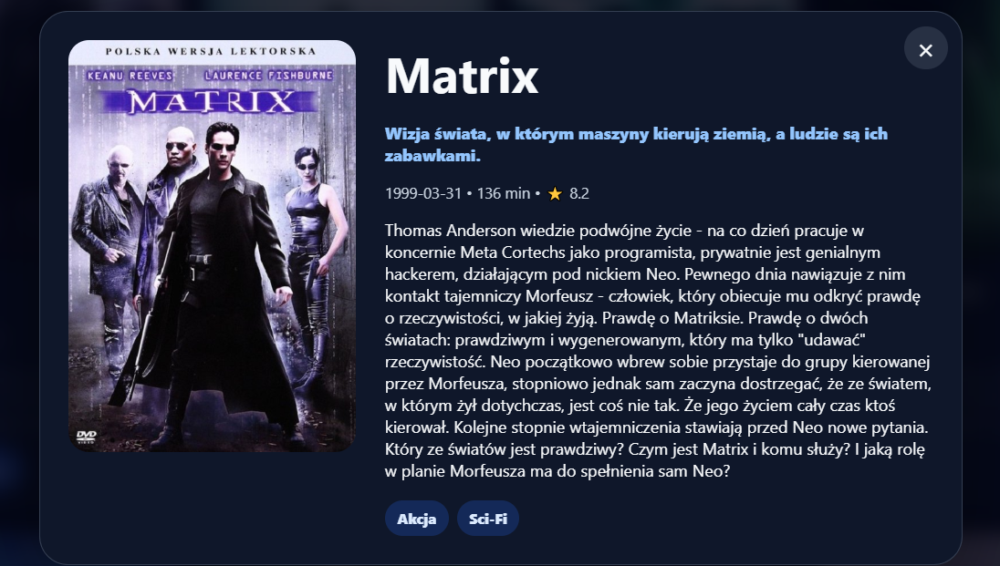
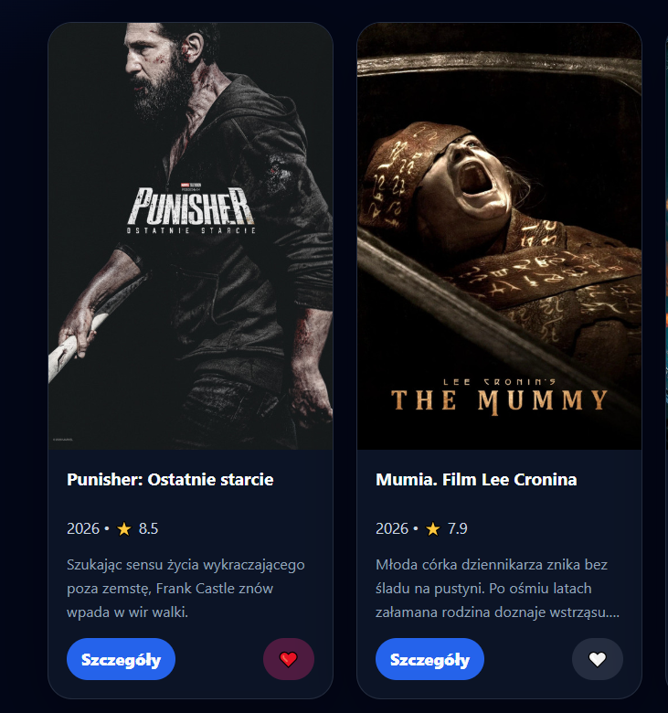

# Movie Browser

Movie Browser is a React + TypeScript application created for Laboratory 9: REST API Integration.  
The application integrates a user interface with The Movie Database API and uses TanStack React Query for server-state management.

## Features

- Fetch popular movies from TMDB API
- Search movies by title
- Debounced search input
- Classic pagination
- Movie details modal
- Favorite movies stored in `localStorage`
- Loading, error, empty and success UI states
- React Query cache and Devtools

## Tech Stack

- React
- TypeScript
- Vite
- TanStack React Query v5
- React Query Devtools
- Axios
- TMDB API
- CSS

## Project Setup

Install dependencies:

```bash
npm install
```

Start the development server:

```bash
npm run dev
```

The application should be available at:

```txt
http://localhost:5173
```

## Environment Variables

Create a `.env` file in the project root:

```env
VITE_TMDB_API_KEY=your_tmdb_api_key
VITE_TMDB_BASE_URL=https://api.themoviedb.org/3
```

The `.env` file must not be committed to the repository.

Use `.env.example` for repository-safe configuration:

```env
VITE_TMDB_API_KEY=
VITE_TMDB_BASE_URL=https://api.themoviedb.org/3
```

## Available Scripts

```bash
npm run dev
```

Runs the application in development mode.

```bash
npm run build
```

Builds the application for production.

```bash
npm run preview
```

Runs a local preview of the production build.

## Main API Endpoints

Popular movies:

```txt
GET /movie/popular?page={page}
```

Movie search:

```txt
GET /search/movie?query={query}&page={page}
```

Movie details:

```txt
GET /movie/{id}
```

## Application Structure

```txt
src/
  api/
    tmdbClient.ts
  components/
    EmptyState.tsx
    ErrorBanner.tsx
    MovieCard.tsx
    MovieGrid.tsx
    MovieModal.tsx
    MoviePagination.tsx
    SkeletonCard.tsx
  constants/
    queryKeys.ts
  hooks/
    useDebounce.ts
    useFavorites.ts
    useFetchMovies.ts
    useMovieDetails.ts
  types/
    movie.ts
  App.tsx
  main.tsx
  index.css
```

## Key Files

### `src/main.tsx`

Configures the root React render, `QueryClientProvider` and React Query Devtools.

React Query default options:

```ts
staleTime: 1000 * 60 * 5;
retry: 2;
refetchOnWindowFocus: false;
```

### `src/api/tmdbClient.ts`

Defines a reusable Axios client for TMDB API.

The client uses:

```ts
VITE_TMDB_API_KEY;
VITE_TMDB_BASE_URL;
```

### `src/constants/queryKeys.ts`

Stores React Query keys in one place.

This avoids duplicated query key strings and makes cache debugging easier.

### `src/hooks/useFetchMovies.ts`

Fetches movie data.

It supports two modes:

- popular movie list
- movie search

It also uses `keepPreviousData` to keep the previous page visible while the next page is loading.

### `src/hooks/useMovieDetails.ts`

Fetches details for a single movie.

The request is enabled only when a movie ID is selected.

### `src/hooks/useDebounce.ts`

Delays the search value by 300 ms.

This prevents sending a request on every single keystroke.

### `src/hooks/useFavorites.ts`

Handles favorite movies.

Favorites are persisted in `localStorage` under the key:

```txt
movie-browser-favorites
```

### `src/components/MovieCard.tsx`

Displays a single movie card with:

- poster
- title
- release year
- rating
- short overview
- details button
- favorite button

### `src/components/MovieModal.tsx`

Displays movie details in a modal.

The modal supports closing by:

- close button
- clicking the backdrop
- pressing Escape

### `src/components/SkeletonCard.tsx`

Displays a skeleton placeholder while movie data is loading.

### `src/components/ErrorBanner.tsx`

Displays API errors and provides a retry button.

### `src/components/EmptyState.tsx`

Displays information when no movies match the current search query.

## UI States

| State            | UI behavior                                             |
| ---------------- | ------------------------------------------------------- |
| Loading          | Skeleton cards are displayed                            |
| Error            | Error banner with retry button is displayed             |
| Empty            | Empty state message is displayed                        |
| Success          | Movie grid is displayed                                 |
| Placeholder data | Previous page remains visible while new data is loading |

## Screenshots

### Main screen



### Movie details



### Favorite movies



## Manual Testing Checklist

- Popular movies load after opening the application
- Search starts after typing at least 2 characters
- Search input is debounced
- Pagination changes pages correctly
- Previous button is disabled on the first page
- Movie details modal opens after clicking a movie
- Movie details are fetched only after opening the modal
- Favorite button adds and removes movies
- Favorite counter updates correctly
- Favorite movies remain after page refresh
- Loading state displays skeleton cards
- Error state displays an error banner
- Empty state appears for queries with no results

## Notes

The application stores only favorite movies in the browser.  
No user account, authentication or backend database is used.
